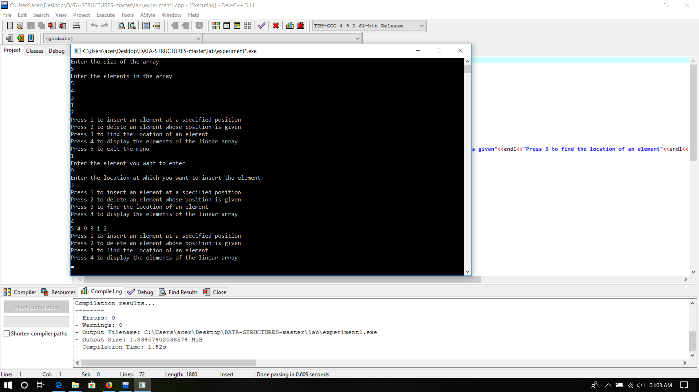

# IMPLIMENTATION OF DS PROGRAMMES_

## Experiment 1 
 
Write a menu driven program that implements following operations on a  linear array:
 Insert a new element at a specified position 
 Delete an element either whose value is given or whose position is given 
 To find the location of a given element
 To display the elements of the linear array 

## Experiment 2
 Write a program to accept N numbers from the user and store them in an array. Then, accept another number from the user and search that using Linear Search. 

## Experiment 3  
 Write a program to accept N integers from the user and store them in an array. Sort the array in ascending order using Bubble sort. Then accept another number from the user, search whether that number exists in the array using Binary Search. If it does, display its index and if it doesn’t, then print that the number is not found in the array. 

## Experiment 4
 Write a menu driven program that implements the following operations on a    doubly and Circular linked list : 
 Insert a new element at the beginning ,end and in-between the given list 
 Delete an existing element 
 Search an element 
 Display all the elements

## Experiment 5
 Write a menu driven program that implements the following operations on a    Stack(either implement as Linear array and as Linked list) :
 Push  
 Pop   
 Display Top of the stack 

## Experiment 6
 Write a program to demonstrate the use of stack in converting arithmetic expression from infix notation to postfix notation and in evaluating arithmetic postfix expression.

## Experiment 7
 Menu driven Program to demonstrate the implementation of various operations on a Circular queue (using a linear array and  a linked list) 

## Experiment 8
 Write a program to accept N numbers in an array, and then sort the array using Insertion Sort. Then accept a number from the user and insert it in the array according to the sequential order 

## Experiment 9
 Write a program to accept N numbers in an array, and then sort the array using Quick Sort. 

## Experiment 10
 Write a program to accept N numbers from the user in one array and M numbers in another array. Then, sort the arrays using Selection Sort and then merge these two arrays using Merge Sort

## Experiment 11
 Write a menu driven program that implements the following operations on a    Binary search tree : 
 Insert a new element  
 Delete an existing element 
 Traversing the tree 
    o Pre-order Traversal 
    o In-order Traversal  
    o Post-order Traversal
    
## Experiment 12   
 Sort the list of integers using heap tree (Heap sort

## Experiment 13
Program including all Operations on Graph and illustrate the traversals using DFS and BFS
